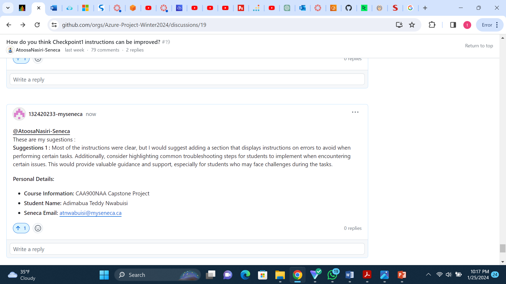

# Checkpoint1 Submission

- **COURSE INFORMATION: CAA900**
- **STUDENT’S NAME: ADIMABUA TEDDY NWABUISI**
- **STUDENT'S NUMBER: 132420233**
- **GITHUB USER_ID: 132420233-myseneca**
- **TEACHER’S NAME: Atoosa Nasiri**
  

---
## Table of Content

- [Collaborator image](#collaborator-image)
- [My Single Line of Code](#my-single-line-of-code)
- [My Multiples Lines of Code](#my-multiple-lines-of-code)
- [Sample .json Object](SAMPLE-.JSON-OBJECT)
- [TABLES](#Tables)
- [Suggestion Image](#SUGGESTION-IMAGE)
- [Useful links](#USEFUL-LINKS)


  

### Collaborator image

     
### MY SINGLE LINE OF CODE
This is my single line of code `Sudo Docker Install`

### MY MULTIPLE LINES OF CODE
```bash
#!/bin/bash

echo "Hello, world!"

a=12
b=10

function add (){
  sum=$(($a + $b))
}
add

echo "Result is: $sum"

echo "This is a my line of code for CAA900 checkpoint1."
```


### SAMPLE .JSON OBJECT 

```json
{
  "name": "John Doe",
  "Program": "CAA",
  "age": 23,
  "city": "Toronto",
  "isEnrolled": true,
  "courses": ["CAA900", "CLO835", "PMC800"],
  "Result": {
    "CAA900": "A+",
    "CLO85": "A+",
    "PMC800: "A+"
  }
}
```
### TABLES
| Employee            | Department         | Position             |
|---------------------|---------------------|--------------------|
| Teddy Nwabuisi     | Marketing          | Marketing Strategist |
| Tobe Segun         | IT            | DevOps Engineer|
| Michael Johnson    | HR                 | HR Adminstrator    |
| Nancy Ukachi       | IT                 | Project Manager  |


 ### SUGGESTION IMAGE



 ### USEFUL LINKS

- [Class Github Organisation](https://github.com/Azure-Project-Winter2024)
- [ Class GitHub Repository](https://github.com/Azure-Project-Winter2024/CAA900-CapstoneProject)
- [Class Github Discussion](https://github.com/orgs/Azure-Project-Winter2024/discussions/19)


