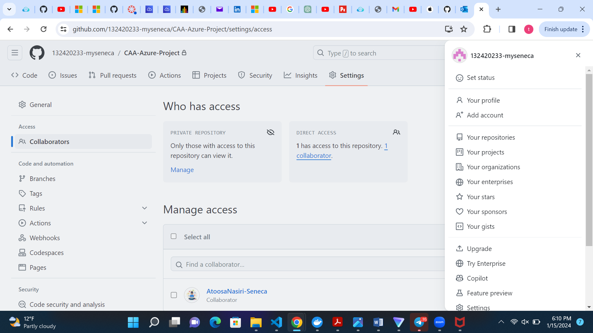

# Checkpoint1 Submission

- **COURSE INFORMATION: xxx**
- **STUDENT’S NAME: xxx**
- **STUDENT'S NUMBER: xxx**
- **GITHUB USER_ID: xxx**
- **TEACHER’S NAME: xxx**
  

---
## Table of Content

- [Collaborator image](#collaborator-image)
- [My Single Line of Code](#my-single-line-of-code)
- [My Multiples Lines of Code](#my-multiple-lines-of-code)
- [Hyperlinks](hyperlinks)
- [TABLES](#tables)

  

### Collaborator image

     
### MY SINGLE LINE OF CODE
This is my single line of code `Sudo Docker Install`

### MY MULTIPLE LINES OF CODE
```bash
#!/bin/bash

echo "Hello, world!"

a=12
b=10

function add (){
  sum=$(($a + $b))
}
add

echo "Result is: $sum"

echo "This is a my line of code for CAA900 checkpoint1."
```

### HYPERLINKS

- [Learn terraform from scratch](https://www.youtube.com/watch?v=7xngnjfIlK4)
- [Markdown Guide](https://www.markdownguide.org/)
- [Learn Docker from scratch](https://www.youtube.com/watch?v=pg19Z8LL06w)


### TABLES
| Employee            | Department         | Role               |
|---------------------|---------------------|--------------------|
| Teddy Nwabuisi     | Marketing          | Marketing Strategist |
| Tobe Segun         | IT            | DevOps Engineer|
| Michael Johnson    | HR                 | HR Adminstrator    |
| Nancy Ukachi       | IT                 | Project Manager  |
