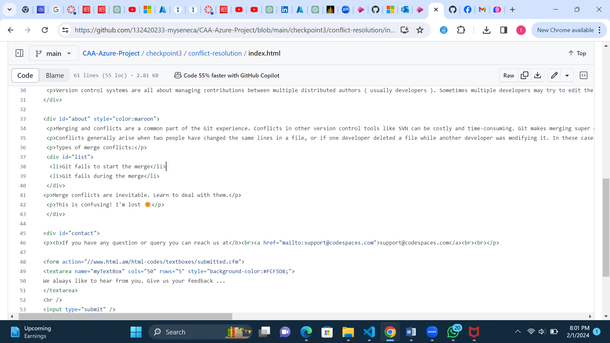
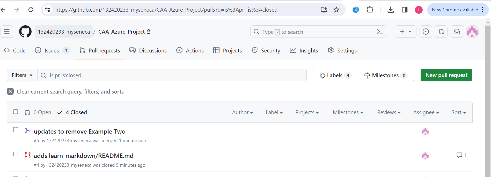

# Checkpoint3 Submission

- **COURSE INFORMATION:** CAA900
- **STUDENT’S NAME:** ADIMABUA TEDDY NWABUISI
- **STUDENT'S NUMBER:** 132420233
- **GITHUB USER ID:** 132420233-myseneca
- **TEACHER’S NAME:** ATOOSA NASIRI
  
# Table of Contents

- [Part A Manage Conflicts - Overwrite Remote Changes](#manage-conflicts-overwrite-remote-changes)
- [Part B - Manage Conflicts - Reset Local Commit Head](#manage-conflicts-reset-local-commit-head)
- [Part C - Manage Conflicts - Merge Editor](#part-c-manage-conflicts-merge-editor)
- [Part D - Collaboration - Creating Pull Request](#collaboration-creating-pull-request)


### Manage Conflicts Overwrite Remote Changes

#### part1-conflict-error.log

- [part1-conflict-error.log](https://github.com/132420233-myseneca/CAA-Azure-Project/blob/main/checkpoint3/logs/part1-conflict-error.log)

``` Markdown
Pushing to https://github.com/132420233-myseneca/CAA-Azure-Project.git
To https://github.com/132420233-myseneca/CAA-Azure-Project.git
 ! [rejected]        main -> main (fetch first)
error: failed to push some refs to 'https://github.com/132420233-myseneca/CAA-Azure-Project.git'
hint: Updates were rejected because the remote contains work that you do
hint: not have locally. This is usually caused by another repository pushing
hint: to the same ref. You may want to first integrate the remote changes
hint: (e.g., 'git pull ...') before pushing again.
hint: See the 'Note about fast-forwards' in 'git push --help' for details.
```
#### part1-conflict-overwrite.log

- [part1-conflict-overwite.log](https://github.com/132420233-myseneca/CAA-Azure-Project/blob/main/checkpoint3/logs/part1-conflict-overwrite.log)

```Markdown
POST git-receive-pack (20756 bytes)
Pushing to https://github.com/132420233-myseneca/CAA-Azure-Project.git
To https://github.com/132420233-myseneca/CAA-Azure-Project.git
 + b41ec11...9017feb main -> main (forced update)
updating local tracking ref 'refs/remotes/origin/main'
```

The text color after forcefully overwriting the remote with local changes was `green`


 ## Manage Conflicts Reset Local Commit Head

#### part2-conflict-error.log

- [part2-conflict-error.log](https://github.com/132420233-myseneca/CAA-Azure-Project/blob/main/checkpoint3/logs/part2-conflict-error.log)

 ```Markdown
 Pushing to https://github.com/132420233-myseneca/CAA-Azure-Project.git
To https://github.com/132420233-myseneca/CAA-Azure-Project.git
 ! [rejected]        main -> main (fetch first)
error: failed to push some refs to 'https://github.com/132420233-myseneca/CAA-Azure-Project.git'
hint: Updates were rejected because the remote contains work that you do
hint: not have locally. This is usually caused by another repository pushing
hint: to the same ref. You may want to first integrate the remote changes
hint: (e.g., 'git pull ...') before pushing again.
hint: See the 'Note about fast-forwards' in 'git push --help' for details.
````

#### part2-pull-error.log

- [part2-pull-error.log](https://github.com/132420233-myseneca/CAA-Azure-Project/blob/main/checkpoint3/logs/part2-pull-error.log)

 ```Markdown
 POST git-upload-pack (196 bytes)
POST git-upload-pack (983 bytes)
From https://github.com/132420233-myseneca/CAA-Azure-Project
   9017feb..cecd2f9  main        -> origin/main
 = [up to date]      feat-emojis -> origin/feat-emojis
Auto-merging checkpoint3/conflict-resolution/index.html
CONFLICT (content): Merge conflict in checkpoint3/conflict-resolution/index.html
Automatic merge failed; fix conflicts and then commit the result.
```

#### part2-reset-head.log

- [part2-reset-head.log](https://github.com/132420233-myseneca/CAA-Azure-Project/blob/main/checkpoint3/logs/part2-reset-head.log)

```Markdown
HEAD is now at 9017feb modifies style color in index.html to green
commit 9017feb3a2e38a290097b6e007c88816c959c7ff
Author: “132420233-myseneca” <“nwabuisiteddy@yahoo.com”>
Date:   Thu Feb 1 18:34:09 2024 -0500

    modifies style color in index.html to green
```


#### part2-pull-success.log

- [part2-pull-success.log](https://github.com/132420233-myseneca/CAA-Azure-Project/blob/main/checkpoint3/logs/part2-pull-success.log)

```Markdown
POST git-upload-pack (196 bytes)
From https://github.com/132420233-myseneca/CAA-Azure-Project
 = [up to date]      main        -> origin/main
 = [up to date]      feat-emojis -> origin/feat-emojis
Updating 9017feb..cecd2f9
Fast-forward
 checkpoint3/conflict-resolution/index.html | 2 +-
 1 file changed, 1 insertion(+), 1 deletion(-)
 ```

The text color after we forcefully overwrote the remote with local changes was still `green` 


## Part C Manage Conflicts Merge Editor

#### part3-pull-conflict.log

- [part3-pull-conflict.log](https://github.com/132420233-myseneca/CAA-Azure-Project/blob/main/checkpoint3/logs/part3-pull-conflict.log)

```Markdown
POST git-upload-pack (375 bytes)
POST git-upload-pack (968 bytes)
From https://github.com/132420233-myseneca/CAA-Azure-Project
 * branch            feat-body-text -> FETCH_HEAD
   94b7552..faebfd2  feat-body-text -> origin/feat-body-text
Auto-merging checkpoint3/conflict-resolution/index.html
CONFLICT (content): Merge conflict in checkpoint3/conflict-resolution/index.html
Automatic merge failed; fix conflicts and then commit the result.
```

#### part3-status.log

- [part3-status.log](https://github.com/132420233-myseneca/CAA-Azure-Project/blob/main/checkpoint3/logs/part3-status.log)

```Markdown
On branch main
Your branch is ahead of 'origin/main' by 1 commit.
  (use "git push" to publish your local commits)

All conflicts fixed but you are still merging.
  (use "git commit" to conclude merge)

Changes to be committed:
	modified:   checkpoint3/conflict-resolution/index.html


```
### Screenshot of merge to the main branch


## Collaboration Creating Pull Request

### Screenshot of the pull request history




