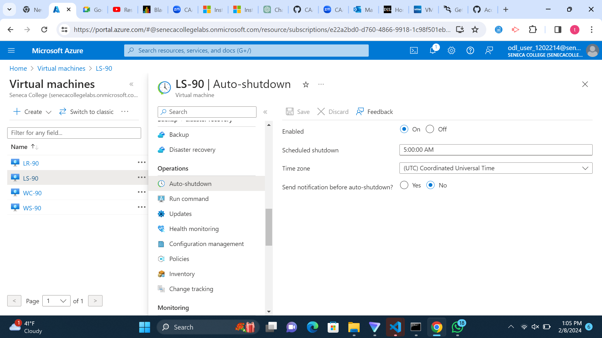

# Checkpoint4 Submission

- **COURSE INFORMATION:** CAA900
- **STUDENT’S NAME:** ADIMABUA TEDDY NWABUISI
- **STUDENT'S NUMBER:** 132420233
- **GITHUB USER ID:** 132420233-myseneca
- **TEACHER’S NAME:** ATOOSA NASIRI
  
# Table of Contents

1. [Part A - Creating Network Resources using Azure CLI](creating- network-resources-using-azure-cli)
2. [Part B -  Working with Azure CLI Bash](#working-with-azure-cli-bash)
3. [Part C - Network Review Questions](#network-review-questions)
4. [Part D - Creating Virtual Machines](#creating-virtual-machines)
5. [Part E - Creating Custom Images](creating-custom-images)
6. [Part F - Clean Up your Environment](#clean-up-your-environment-using-azure-cli)


## Creating Network Resources Using Azure CLI

### Updated lines in the networkconfig.sh
``` bash 
RG_NAME="Student-RG-1202214"     # your student group
LOCATION="canadacentral"    # your location
ID="90"          #unique ID assigned to you

Student_vnet_name="Student-1202214-vnet"
Student_vnet_address="10.14.17.0/24"
Client_Subnet_name="Virtual-Desktop-Client"
Client_Subnet_address="10.14.17.0/24"

```

- **Question 1:** This determines whether a resource group with the name specified in the variable $RG_NAME exists in the Azure environment. If the resource group does not exist, the condition evaluates to true, and the script continues its execution.

- **Question 2 :** This line checks if a resource exists
`if [[ $(az network vnet list -g $RG_NAME -o tsv --query "[?name=='$vnet']") ]]`

``` bash
### This line of code was used to check if vnte exists befor creating it
echo "Check if it already exists ---"
if [[ $(az network vnet list -g $RG_NAME -o tsv --query "[?name=='$vnet']") ]]; then
    echo "exists!"
    az network vnet show -g $RG_NAME --name $vnet --query id 
else
    echo "doesn't exist!"
    # Code for creating the VNET
fi
```

- **Question 3 :**

```bash
az network vnet create -g Student-RG-1202214 \
    --name Router-90 \
    --location canadacentral \
    --address-prefix 192.168.90.0/24
```
 - **Question 3:** The bash command below is used on Azure Cli to create the subnet

```bash
az network vnet subnet create --name SN1 \
    -g Student-RG-1202214 \
    --vnet-name Router-90 \
    --address-prefix 192.168.90.32/27
```

## Working with Azure CLI Bash
1)  [List-of-vnets]()

2) [default-student-vnet]()

 ### 3) Peering table
| AllowForwardedTraffic | AllowGatewayTransit | AllowVirtualNetworkAccess | DoNotVerifyRemoteGateways | Name                  | PeeringState | PeeringSyncLevel | ProvisioningState | ResourceGroup      | ResourceGuid                          | UseRemoteGateways |
|-----------------------|---------------------|---------------------------|---------------------------|-----------------------|--------------|------------------|-------------------|--------------------|---------------------------------------|-------------------|
| True                  | False               | True                      | False                     | RoutertoStudent       | Connected    | FullyInSync      | Succeeded         | Student-RG-1202214 | c759eefc-bac2-0b49-0345-ff853eb5984d | False             |
| True                  | False               | True                      | False                     | RoutertoServer        | Connected    | FullyInSync      | Succeeded         | Student-RG-1202214 | 643051b6-1413-08c2-36a0-057ba7f670e2 | False             |
| AllowForwardedTraffic | AllowGatewayTransit | AllowVirtualNetworkAccess | DoNotVerifyRemoteGateways | Name                  | PeeringState | PeeringSyncLevel | ProvisioningState | ResourceGroup      | ResourceGuid                          | UseRemoteGateways |
|-----------------------|---------------------|---------------------------|---------------------------|-----------------------|--------------|------------------|-------------------|--------------------|---------------------------------------|-------------------|
| True                  | False               | True                      | False                     | ServertoRouter        | Connected    | FullyInSync      | Succeeded         | Student-RG-1202214 | 643051b6-1413-08c2-36a0-057ba7f670e2 | False             |
| AllowForwardedTraffic | AllowGatewayTransit | AllowVirtualNetworkAccess | DoNotVerifyRemoteGateways | Name                    | PeeringState | PeeringSyncLevel | ProvisioningState | ResourceGroup      | ResourceGuid                          | UseRemoteGateways |
|-----------------------|---------------------|---------------------------|---------------------------|-------------------------|--------------|------------------|-------------------|--------------------|---------------------------------------|-------------------|
| True                  | False               | True                      | False                     | Student-Bastion1202214 | Connected    | FullyInSync      | Succeeded         | Student-RG-1202214 | 80623fb1-0ec4-084c-2266-25c3521d0b84 | False             |
| True                  | False               | True                      | False                     | StudenttoRouter        | Connected    | FullyInSync      | Succeeded         | Student-RG-1202214 | c759eefc-bac2-0b49-0345-ff853eb5984d | False             |

 ###  4) List of all routes in RT-90
  
  | AddressPrefix  | HasBgpOverride | Name           | NextHopIpAddress | NextHopType      | ProvisioningState | ResourceGroup      |
|----------------|----------------|------------------|------------------|------------------|-------------------|--------------------|
| 172.17.90.32/27| False          | Route-to-Server  | 192.168.90.36    | VirtualAppliance | Succeeded         | Student-RG-1202214|
| 10.14.17.0/24  | False          | Route-to-Desktop | 192.168.90.36    | VirtualAppliance | Succeeded         | Student-RG-1202214|


## Network Review Questions

### Azure Virtual Network (VNET)
Azure Virtual Network (VNET) is basically a fundamental networking feature of Azure , which enables customers and various users to establish segregated network environments. For the safe deployment and administration of Azure resources, it offers subnets, private IP address spaces, and security measures. VNETs facilitate smooth network extension by supporting sophisticated networking features like VPN Gateway, ExpressRoute, and peering. It also works hand in with azure bastion services and Azure firewall service

### How on-prem computers can access resources inside Azure virtual network

  On-premises resources can use secure network connections to access services within an Azure Virtual Network (VNET) in a hybrid cloud architecture. Using Azure VPN Gateway to establish a site-to-site VPN connection and build an encrypted internet tunnel for secure communication is one popular technique. As an alternative, ExpressRoute provides a private, dedicated connection that guarantees consistent performance and increased security between on-premises networks and Azure. 

  Furthermore, Azure VMs may have controlled RDP/SSH access without being exposed to the public internet thanks to Azure Bastion. These technologies make it possible for Azure and on-premises infrastructure to integrate seamlessly, enabling safe resource access across environments.

 ### Advantages of Azure Virtual Network

 Azure Virtual Networks (VNETs) provide significant advantages for cloud networking:

- **Isolated Environments**: VNETs create isolated environments within Azure,this helps greatly in resource segmentation and a well improved and secured network environment for it's users.

- **Customizable IP Addressing**: Azure users can create private IP address spaces for maximum resource management without any  IP conflicts.

- **Scalability and Integration**: VNETs are readily scaled to handle growth and interface seamlessly with other Azure services for more efficient deployment.


- **Integration with On-Premises Networks**:A well flowing connectivity choices such as VPN Gateway and ExpressRoute, enabling hybrid cloud situations are provided when using virtual networks


### Difference between NSG and RouteTable

**Network Security groups:** In a Virtual Network (VNET), NSGs act as firewalls, controlling traffic entering and departing network resources.To improve network security, they set rules that allow or prohibit traffic based on source and destination addresses, ports, and protocols. NSGs are used to regulate traffic flow, restrict resource access, and protect against threats or unauthorized access.

**Route Tables:**  Using the target IP address, route tables direct traffic inside a VNET to specific destinations.  They manage the flow of traffic between different network components, such as subnets and internet gateways.  Route tables make it easier to regulate communication between various network components and govern traffic flow inside a virtual network environment.
convert this text to markdown format.

### Difference between NSG and Firewall
**Network Security groups:** Designed particularly for cloud systems such as Azure Virtual Networks (VNETs), NSGs manage traffic flow to and from network resources at the network level. With built-in security measures designed specifically for cloud platforms, they provide granular management depending on IP addresses, ports, and protocols.

**Firewalls:** Firewalls are frequently installed in network infrastructure and function at many levels, such as network, application, and endpoint. While they might provide more  capabilities like  intrusion detection and prevention systems (IDPS), they also help to provide traffic management that is comparable to that of NSGs. In order to provide more comprehensive security features appropriate for a range of situations, firewalls can be installed as stand-alone hardware, software programs, or virtual appliances.


###  Hob-and-spoke network topology and how it can be deployed in Azure Cloud
In an Azure hub-and-spoke network design, many "spoke" Virtual Networks (VNETs) are connected to a central "hub" Virtual Network (VNET). VNET peering is used to accomplish this configuration, enabling secure communication between the hub and spokes. Traffic control may be achieved through the use of network security tools like Azure Firewall and Network Security Groups (NSGs). Virtual Network Gateways also make it easier to establish safe connections between the hub VNET and on-site or external networks. Within the Azure environment.This helps in improved security and effective communication between networks

### When working with Azure VNETs, are gateways needed for Azure to route traffic between subnets?

Gateways aren't necessarily necessary in Azure VNETs to route traffic between subnets inside the same VNET. However, gateways such virtual network gateways or internet gateways could be required if connecting to on-premises networks or the internet. Depending on the particular networking needs of the Azure environment, these gateways may provide outward internet access or secure connections.

### When do you need to configure and use Virtual Network Gateways?
When you need to create safe and dependable connections between Azure virtual networks, on-premises networks, or remote networks, you must configure and utilize Virtual Network Gateways in Azure. When establishing ExpressRoute connections, site-to-site VPNs, or point-to-site VPNs, this is necessary to provide safe data transmission and communication between various network environments.


## Creating Virtual Machines


###  1) List of Vms created
| Name  | ResourceGroup     | Location       | Zones |
|-------|-------------------|----------------|-------|
| LR-90 | STUDENT-RG-1202214| canadacentral  |       |
| LS-90 | STUDENT-RG-1202214| canadacentral  |       |
| WC-90 | STUDENT-RG-1202214| canadacentral  |       |
| WS-90 | STUDENT-RG-1202214| canadacentral  |       |

### 2) [details-of-WC90-vm]()
     
I used the `az vm show --resource-group Student-RG-1202214 --name WC-90 --output json > WC-90-details.json` command to generate the output of the json 

### 3) [details-of-nsg-created]()
  
  | Location       | Name       | ProvisioningState | ResourceGroup      | ResourceGuid                            |
| -------------- | ---------- | ----------------- | ------------------| --------------------------------------- |
| canadacentral | LR-NSG-90  | Succeeded         | Student-RG-1202214| 3a3a7634-e80c-46a7-ae77-7c135b5929b9   |
| canadacentral | LS-NSG-90  | Succeeded         | Student-RG-1202214| c842ea4f-cbfb-40cc-b88d-a2f2ad6870e5   |
| canadacentral | WC-NSG-90  | Succeeded         | Student-RG-1202214| 48e49acb-9146-4a58-940a-0c1920f63408   |
| canadacentral | WS-NSG-90  | Succeeded         | Student-RG-1202214| 948ac0e5-b20c-4c53-ba6f-6798c0573203   |

### 4)  Screenshot of the auto shutdown configuration for LS_90




### 5) Why auto shutdown configuration is not done in vm_create code? Why is it a separate scripts? Is it possible to configure auto shutdown at the same time you are creating the VM?

For flexibility and ease of maintenance, auto-shutdown configuration is frequently completed in a separate script. The auto-shutdown configuration can be made concurrently with virtual machine creation.But then the auto-shutdown script is focused on establishing rules, while the VM formation script is focused on supplying resources, which is why it is separated. Better codebase structure, readability, and scalability are made possible by this division.

## Creating Custom Images

1)

```bash
az vm create --name $vm_name -g $RG_NAME  \
        --location $LOCATION \
        --admin-password $ADMIN_PW --admin-username $USER_NAME \
        --image  $image_name \
        --size  $VM_SIZE \
        --storage-sku $OS_DISK_SKU \
        --data-disk-delete-option Delete \
        --nics  $nic_name \
        --no-wait
```

Although the two scripts are quite similar, the custom_vm_create.sh script differs in one important way. The `$image_name` variable in the custom_vm_create.sh script is created using the `$target_version` variable, which is passed to the script as an input. This suggests that the script is building virtual machines  from version-specific custom images and that selecting different versions of the custom image is flexible.Hence we can have differnt versions of a virtual machine when creating from this custom image script

### 2.) The usage selection when not adding version number trying to run the `custom_vm_create.sh` script

`target_version parameter not provided
Usage: ./image_create.sh <target_version>`

This simply means the scripts requires a parameter called target_version to be provided. so the right would be `./custom_ vm_create.sh 1.0`

### 3.) The command to run 


### 4.) lists all the Custom Images
 
 [custom-images]()


| HyperVGeneration | Location       | Name           | ProvisioningState | ResourceGroup      |
|------------------|----------------|----------------|-------------------|--------------------|
| V2               | canadacentral | lr-90-ver-1.0  | Succeeded         | Student-RG-1202214|
| V2               | canadacentral | ls-90-ver-1.0  | Succeeded         | Student-RG-1202214|
| V2               | canadacentral | wc-90-ver-1.0  | Succeeded         | Student-RG-1202214|
| V1               | canadacentral | ws-90-ver-1.0  | Succeeded         | Student-RG-1202214|


### 5.)


### 6.) List of custom image,Nic,Nsg in tabular form

- **Custom image**

| HyperVGeneration | Location       | Name           | ProvisioningState | ResourceGroup      |
|------------------|----------------|----------------|-------------------|--------------------|
| V2               | canadacentral | lr-90-ver-1.0  | Succeeded         | Student-RG-1202214|
| V2               | canadacentral | ls-90-ver-1.0  | Succeeded         | Student-RG-1202214|
| V2               | canadacentral | wc-90-ver-1.0  | Succeeded         | Student-RG-1202214|
| V1               | canadacentral | ws-90-ver-1.0  | Succeeded         | Student-RG-1202214|


- **VM**

| Name  | ResourceGroup      | Location       | Zones |
|-------|-------------------|---------------|-------|
| LR-90 | STUDENT-RG-1202214| canadacentral |       |
| LS-90 | STUDENT-RG-1202214| canadacentral |       |
| WC-90 | STUDENT-RG-1202214| canadacentral |       |
| WS-90 | STUDENT-RG-1202214| canadacentral |       |


-**Nic**


| AuxiliaryMode | AuxiliarySku | DisableTcpStateTracking | EnableAcceleratedNetworking | EnableIPForwarding | Location       | Name  | NicType  | ProvisioningState | ResourceGroup      | ResourceGuid                        | VnetEncryptionSupported | MacAddress    | Primary |
|---------------|--------------|-------------------------|-----------------------------|--------------------|----------------|-------|----------|-------------------|--------------------|-------------------------------------|------------------------|---------------|---------|
| None          | None         | False                   | False                       | False              | canadacentral | lr-90 | Standard | Succeeded         | Student-RG-1202214 | de70a398-23ad-4dc0-b82d-c6d79c3d00f3 | False                  |               |         |
| None          | None         | False                   | False                       | False              | canadacentral | ls-90 | Standard | Succeeded         | Student-RG-1202214 | b3420624-06e9-49b4-8afb-5509158913c8 | False                  |               |         |
| None          | None         | False                   | False                       | False              | canadacentral | wc-90 | Standard | Succeeded         | Student-RG-1202214 | 19d266f7-456e-4dbc-bc07-01ad3d99e11a | False                  |               |         |
| None          | None         | False                   | False                       | False              | canadacentral | ws-90 | Standard | Succeeded         | Student-RG-1202214 | 5542c1cb-6569-4672-971d-0d8972017cd7 | False                  | 00-0D-3A-F3-12-09 | True    |


- **Nsg**

| Location       | Name      | ProvisioningState | ResourceGroup      | ResourceGuid                        |
|----------------|-----------|-------------------|--------------------|-------------------------------------|
| canadacentral | LR-NSG-90 | Succeeded         | Student-RG-1202214| 3a3a7634-e80c-46a7-ae77-7c135b5929b9|
| canadacentral | LS-NSG-90 | Succeeded         | Student-RG-1202214| c842ea4f-cbfb-40cc-b88d-a2f2ad6870e5|
| canadacentral | WC-NSG-90 | Succeeded         | Student-RG-1202214| 48e49acb-9146-4a58-940a-0c1920f63408|
| canadacentral | WS-NSG-90 | Succeeded         | Student-RG-1202214| 948ac0e5-b20c-4c53-ba6f-6798c0573203|


## Clean Up your Environment using Azure CLI


