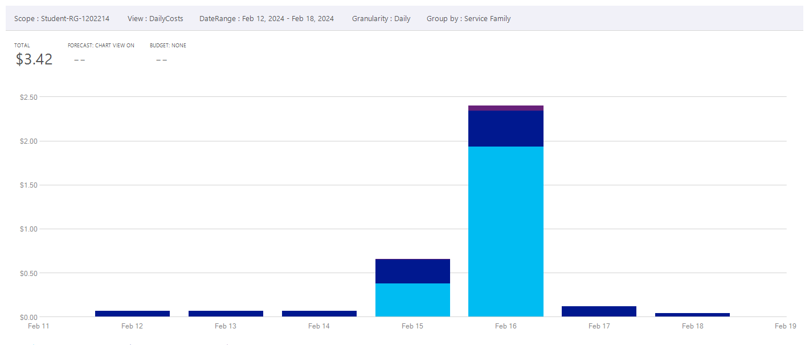
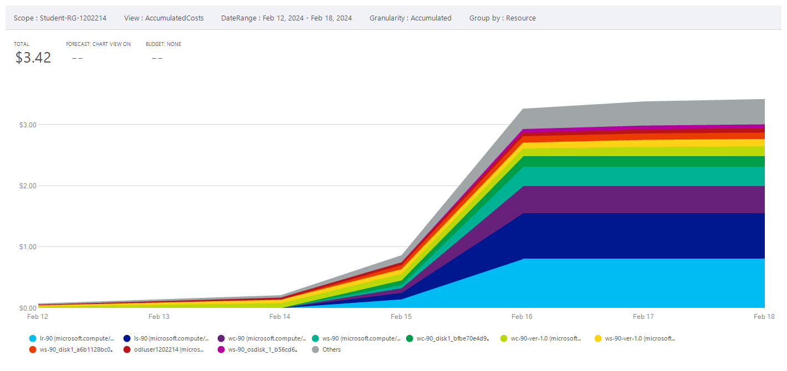
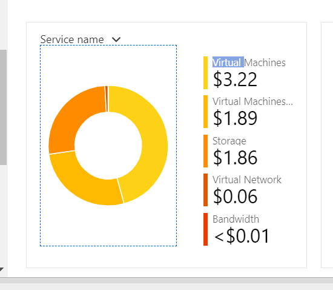
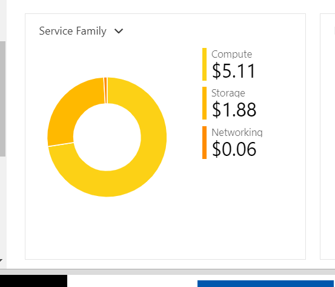
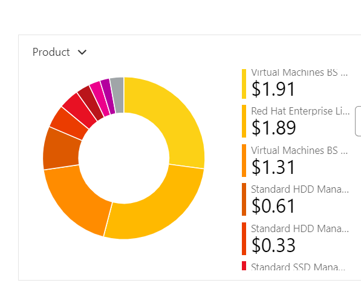
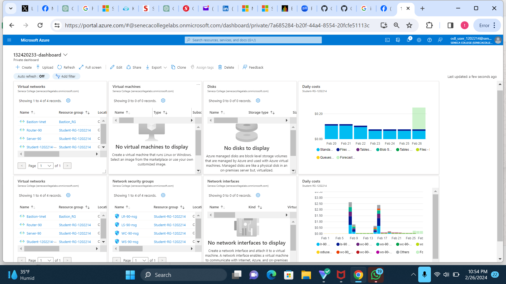

# Checkpoint5 Submission

- **COURSE INFORMATION:** CAA900
- **STUDENT’S NAME:** ADIMABUA TEDDY NWABUISI
- **STUDENT'S NUMBER:** 132420233
- **GITHUB USER ID:** 132420233-myseneca
- **TEACHER’S NAME:** ATOOSA NASIRI
  
# Table of Contents

1. [Part A - Creating & Configuring VMs - Using Portal](#creating--configuring-vms---using-portal)
2. [Part B - Enable IP_Forwarding - Using Portal](#enable-ip_forwarding---using-portal)
3. [Part C - Basic Connectivity - VM Configuration](#basic-connectivity---vm-configuration)
4. [Part D - Creating & Configuring VM Images - Using Portal](#creating--configuring-vm-images---using-portal)
5. [Part E - Azure Cost Analysis Charts](#azure-cost-analysis-charts)
6. [Part F - Create Customized Azure Dashboard](#create-customized-azure-dashboard)


### Creating & Configuring VMs - Using Portal

The key difference between Network Security Group (NSG) rules for Windows and Linux machinesis which ports and protocols are utilized by each operating system for communication and remote access.

For Windows machines:
- Generally, NSG rules for Windows computers permit Remote Desktop Protocol (RDP) traffic on port 3389 in order to facilitate remote desktop access.


For Linux machines:
- Generally, NSG guidelines for Linux systems entail permitting Secure Shell (SSH) communication on port 22 in order to grant remote command-line access.


- The differences might be attributed to the default protocols and services that are implemented by each operating system. Linux systems often utilize SSH for remote shell access, whereas Windows systems often use RDP for remote desktop access.


- VM LIST 

| Name  | ResourceGroup      | Location      | Zones |
|-------|--------------------|---------------|-------|
| LR-90 | Student-RG-1202214 | canadacentral | 1     |
| LS-90 | Student-RG-1202214 | canadacentral | 1     |
| WC-90 | Student-RG-1202214 | canadacentral | 1     |
| WS-90 | Student-RG-1202214 | canadacentral | 1     |

- NIC LIST

| AuxiliaryMode | AuxiliarySku | DisableTcpStateTracking | EnableAcceleratedNetworking | EnableIPForwarding | Location       | MacAddress       | Name         | NicType  | Primary | ProvisioningState | ResourceGroup      | ResourceGuid                          | VnetEncryptionSupported |
|---------------|--------------|--------------------------|------------------------------|--------------------|---------------|-----------------|--------------|----------|---------|-------------------|--------------------|---------------------------------------|-------------------------|
| None          | None         | False                    | False                        | False              | canadacentral | 60-45-BD-5C-64-9B | lr-90518_z1 | Standard | True    | Succeeded         | Student-RG-1202214 | ef2e5506-48f3-46d6-bdc2-7e434eebcd4a | False                   |
| None          | None         | False                    | False                        | False              | canadacentral | 00-22-48-B0-A3-45 | ls-90193_z1 | Standard | True    | Succeeded         | Student-RG-1202214 | fc47e8aa-ec96-40fc-8fe9-a7a31fd2f7ca | False                   |
| None          | None         | False                    | False                        | False              | canadacentral | 60-45-BD-5F-B9-5E | wc-90536_z1 | Standard | True    | Succeeded         | Student-RG-1202214 | 5415cb80-3450-4d3e-9be4-369c9d17fa42 | False                   |
| None          | None         | False                    | False                        | False              | canadacentral | 00-0D-3A-0C-8E-9A | ws-90559_z1 | Standard | True    | Succeeded         | Student-RG-1202214 | 49e1a256-908d-44dd-a1e0-ceae354602d8 | False                   |


- NSG LIST

| Location       | Name         | ProvisioningState | ResourceGroup      | ResourceGuid                          |
|----------------|--------------|-------------------|--------------------|---------------------------------------|
| canadacentral | LR-90-nsg    | Succeeded         | Student-RG-1202214 | 55cc3e12-3af0-493a-bce0-43a946db29d2 |
| canadacentral | LS-90-nsg    | Succeeded         | Student-RG-1202214 | 22a63957-8078-4ae9-8f8e-e46c0f947e6b |
| canadacentral | LS90nsg119   | Succeeded         | Student-RG-1202214 | 3af0408d-839f-4f7a-a335-85788af78955 |
| canadacentral | WC-90-nsg    | Succeeded         | Student-RG-1202214 | baf94063-616e-48b3-b2a8-49a9572e796f |
| canadacentral | WC90nsg462   | Succeeded         | Student-RG-1202214 | 439a1c8a-6e9a-4b22-bccc-3be9254d770b |
| canadacentral | WS-90-nsg    | Succeeded         | Student-RG-1202214 | 83802e0c-81a0-4605-98ca-c765c4d68adc |

- DISK LIST

| Name                                             | ResourceGroup      | Location       | Zones | Sku          | OsType  | SizeGb | ProvisioningState |
|--------------------------------------------------|-------------------|----------------|-------|--------------|---------|--------|-------------------|
| LR-90_OsDisk_1_a4cfb72438df450da929196cd3d5b99c | Student-RG-1202214 | canadacentral | 1     | Standard_LRS | Linux   | 64     | Succeeded         |
| LS-90_OsDisk_1_c31bb1bfc24c4577a195d7c608f2cf25 | Student-RG-1202214 | canadacentral | 1     | Standard_LRS | Linux   | 64     | Succeeded         |
| WC-90_disk1_bfbe70e4d90e45809a99884ff24ca8bf    | Student-RG-1202214 | canadacentral | 1     | Standard_LRS | Windows | 127    | Succeeded         |
| WS-90_disk1_a6b1128bc06f47f48be4b0912a7bce6f    | Student-RG-1202214 | canadacentral | 1     | Standard_LRS | Windows | 127    | Succeeded         |


### Enable IP_Forwarding - Using Portal

1) To Check the status of ip-forwarding using the command
`az network nic ip-config show --nic-name lr-90852_z1 --resource-group Student-RG-1202214 --name ipconfig1 --query "[?name=='ipconfig1'].enableIpForwarding" --output json`


2) The line on the json file which shows the property of the  status of the ip-forwarding is : `"enableIPForwarding": true`

 [Ipforwarding](https://github.com/132420233-myseneca/CAA-Azure-Project/blob/main/checkpoint5/ipfowarding.json)


### Basic Connectivity - VM Configuration

1) To remove the firewalld service on a Linux system, you can use the following commands:

```bash
sudo systemctl stop firewalld
sudo systemctl disable firewalld
 ```

 2) To check the status of an iptable service on a Linux system, you can use the following command `sudo systemctl status iptables`

 3) For the iptables to start automatically;we have to run the command `sudo systemctl enable iptables`.  


 4) To show all iptables chains with their order number on the LR-90 system you can use the following command:  `sudo iptables -L --line-numbers`

 [Iptable-chain](https://github.com/132420233-myseneca/CAA-Azure-Project/blob/main/checkpoint5/iptables-chain.tbl)

 | Chain  | num | target | prot | opt | source    | destination | notes                      |
|--------|-----|--------|------|-----|-----------|-------------|----------------------------|
| INPUT  | 1   | ACCEPT | all  | --  | anywhere  | anywhere    | state RELATED,ESTABLISHED |
| INPUT  | 2   | ACCEPT | icmp | --  | anywhere  | anywhere    |                            |
| INPUT  | 3   | ACCEPT | all  | --  | anywhere  | anywhere    |                            |
| INPUT  | 4   | ACCEPT | tcp  | --  | anywhere  | anywhere    | state NEW tcp dpt:ssh     |
| INPUT  | 5   | REJECT | all  | --  | anywhere  | anywhere    | reject-with icmp-host-prohibited |
| FORWARD| 1   | DROP   | tcp  | --  | anywhere  | anywhere    | tcp dpt:ssh                |
| FORWARD| 2   | REJECT | all  | --  | anywhere  | anywhere    | reject-with icmp-host-prohibited |
| FORWARD| 3   | DROP   | tcp  | --  | anywhere  | anywhere    | tcp dpt:ssh                |
| OUTPUT |     | ACCEPT | all  | --  | anywhere  | anywhere    |                            |

5) We run the command `hostname` to get the hostnames of our virtual machines.Below is the link to the output files showing the output of the two virtual machines
- [Hostname-LR](https://github.com/132420233-myseneca/CAA-Azure-Project/blob/main/checkpoint5/hostname-LR.txt)

- [Hostname-LS](https://github.com/132420233-myseneca/CAA-Azure-Project/blob/main/checkpoint5/hostname-LS.txt)


###  Creating & Configuring VM Images - Using Portal

1) [images-list]((https://github.com/132420233-myseneca/CAA-Azure-Project/blob/main/checkpoint5/images.tbl))

| HyperVGeneration | Location       | Name             | ProvisioningState | ResourceGroup     |
|------------------|----------------|------------------|-------------------|-------------------|
| V1               | canadacentral | LR-90-ver-0.0.1 | Succeeded         | STUDENT-RG-1202214 |
| V2               | canadacentral | lr-90-ver-1.0    | Succeeded         | STUDENT-RG-1202214 |
| V1               | canadacentral | LS-90-ver-0.0.1 | Succeeded         | STUDENT-RG-1202214 |
| V2               | canadacentral | ls-90-ver-1.0    | Succeeded         | STUDENT-RG-1202214 |
| V1               | canadacentral | WC-90-ver-0.0.1 | Succeeded         | STUDENT-RG-1202214 |
| V2               | canadacentral | wc-90-ver-1.0    | Succeeded         | STUDENT-RG-1202214 |
| V1               | canadacentral | WS-90-ver-0.0.1 | Succeeded         | STUDENT-RG-1202214 |
| V1               | canadacentral | ws-90-ver-1.0    | Succeeded         | STUDENT-RG-1202214 |

2) The Output of the table was empty after running the command `az vm list --output table > vmm.tbl` because we already deleted the virtual machines in the resource group

3) The process of creating the Virtual Machines from the custom image took almost thesame period of time as creating using the normal images from azure. [images-list]((https://github.com/132420233-myseneca/CAA-Azure-Project/blob/main/checkpoint5/vmm.tbl))


To enhance the efficiency of the VM creation we can make use of automation tools like terraform this would help to ensure consistency and reduce manual efforts.We could also develop templates to streamline deployment and minimize human efforts


### Azure Cost Analysis Charts


| No. | Scope | Chart Type | VIEW Type |  Date Range | Group By | Granularity| Example |
|-|-|-|-|-|-|-|-|
|1|Student-RG-1202214 | Column (Stacked) | DailyCosts | Last 7 Days | Resource | Daily |  |
|2|Student-RG-1202214 | Column (Stacked) | DailyCosts | Last 7 Days | Service | Daily |  |
|3|Student-RG-1202214 | Area| AccumulatedCosts | Last 7 Days | Resource | Accumulated |  |
|4|Student-RG-1202214 | Pie Chart | NA | Last Month | Service Name | NA |  |
|5|Student-RG-1202214 | Pie Chart | NA | Last Month | Service Family | NA |  |
|6|Student-RG-1202214 | Pie Chart | NA | Last Month | Product | NA |  |

### Create Customized Azure Dashboard





