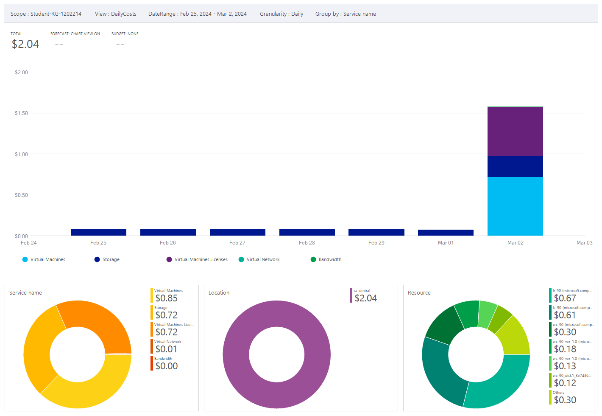
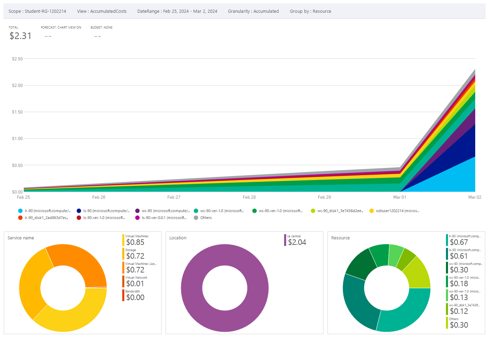
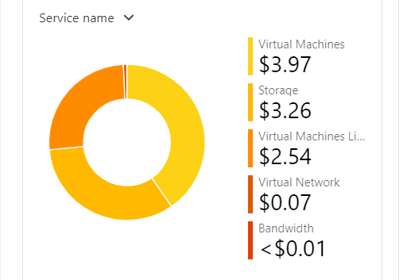
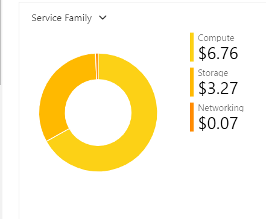
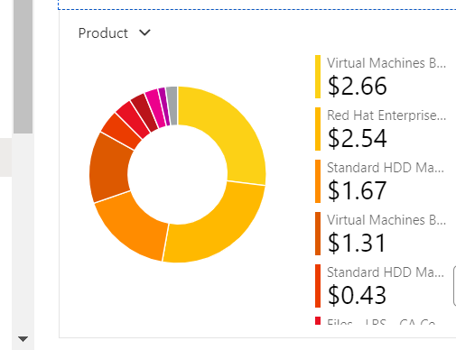
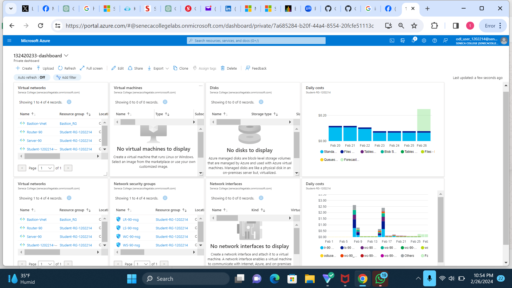

# Checkpoint6 Submission

- **COURSE INFORMATION:** CAA900
- **STUDENT’S NAME:** ADIMABUA TEDDY NWABUISI
- **STUDENT'S NUMBER:** 132420233
- **GITHUB USER ID:** 132420233-myseneca
- **TEACHER’S NAME:** ATOOSA NASIRI
  
# Table of Contents

1. [Part A - Basic Connectivity - Linux VMs Firewall Setting](#part-a---basic-connectivity---linux-vms-firewall-setting)
2. [Part B - Azure Cost Analysis Charts](#part-b---azure-cost-analysis-charts)

# Part A - Basic Connectivity - Linux VMs Firewall Setting

1)  The command `sudo iptables -nvL` would show the iptable chains of the LR-90 VM

- The default output of the  iptables often has a policy of "ACCEPT" for the INPUT and OUTPUT chains and "DROP" for the FORWARD chain.

- To improve security and reduce vulnerability to attacks:
1) Change the default policy for all chains from "ACCEPT" to "DROP" by setting the "Default Deny Policy" setting. Unless specifically permitted, this by default blocks all communications.
2) Establish Explicit Allow Rules: Modify iptables to include rules that only allow essential traffic, such HTTP(80),SSH (22 ),RDP.

2) We run the command `hostname` to get the hostnames of our virtual machines.Below is the link to the output files showing the output of the two virtual machines
- [Hostname-LR](https://github.com/132420233-myseneca/CAA-Azure-Project/blob/main/checkpoint6/hostname-LR.txt)

- [Hostname-LS](https://github.com/132420233-myseneca/CAA-Azure-Project/blob/main/checkpoint6/hostname-LS.txt)

3)  These are the links to the file for the iptable chains for lr-90 and ls-90 iptables

- [LR-90-IPTABLE](https://github.com/132420233-myseneca/CAA-Azure-Project/blob/main/checkpoint6/lr_iptables.txt)

- [LS-90-IPTABLE](https://github.com/132420233-myseneca/CAA-Azure-Project/blob/main/checkpoint6/ls_iptables.txt
)

# Part B - Azure Cost Analysis Charts

### Azure Cost Analysis Charts

| No. | Scope | Chart Type | VIEW Type |  Date Range | Group By | Granularity| Example |
|-|-|-|-|-|-|-|-|
|1|Student-RG-1202214 | Column (Stacked) | DailyCosts | Last 7 Days | Resource | Daily |  |
|2|Student-RG-1202214 | Column (Stacked) | DailyCosts | Last 7 Days | Service | Daily |  |
|3|Student-RG-1202214 | Area| AccumulatedCosts | Last 7 Days | Resource | Accumulated |  |
|4|Student-RG-1202214 | Pie Chart | NA | Last Month | Service Name | NA |  |
|5|Student-RG-1202214 | Pie Chart | NA | Last Month | Service Family | NA |  |
|6|Student-RG-1202214 | Pie Chart | NA | Last Month | Product | NA |  |

###  Azure Dashboard

